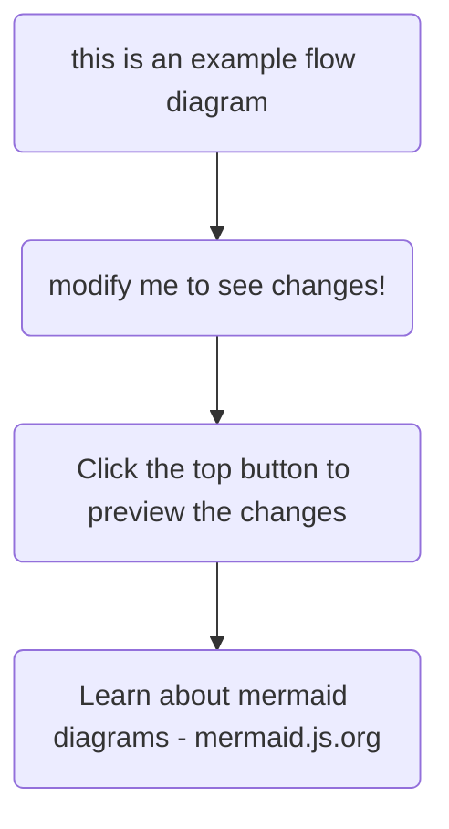

let me just write something here

| heading | another heading |
| ------- | --------------- |
| text    | another text    |

dsdsd



```html
<code>This is a code block</code>
```


```js
// Javascript code with syntax highlighting.
var fun = function lang(l) {
  dateformat.i18n = require('./lang/' + l);
  return true;
};
```

<span class="token keyword">function</span> 
<span class="token string">"hello world"</span>;

<div class="social-sharing">
  <a href="https://twitter.com/intent/tweet?text=Check%20out%20this%20blog%20post!&url=https://example.com/seo-tips" target="_blank">Share on Twitter</a>
  <a href="https://www.facebook.com/sharer/sharer.php?u=https://example.com/seo-tips" target="_blank">Share on Facebook</a>
  <a href="https://www.linkedin.com/shareArticle?mini=true&url=https://example.com/seo-tips&title=SEO%20Tips" target="_blank">Share on LinkedIn</a>
</div>

## JavaScript Example

```js
// This is a test function
const greet = (name) => {
  const message = `Hello, ${name}!`;
  console.log(message);
  return message;
};

// Using string literals with your custom color
const html = `<div class="container">
  <h1>Welcome</h1>
</div>`;
