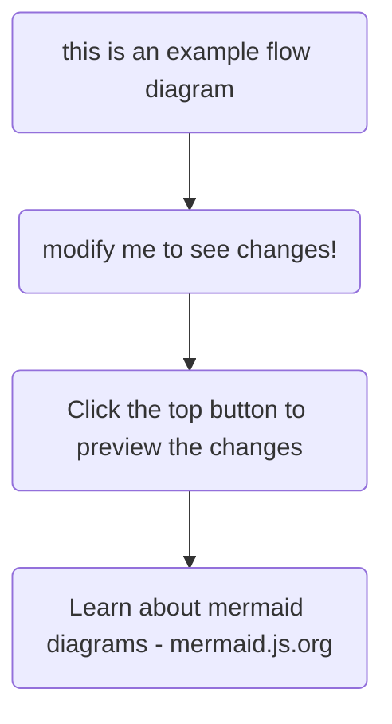

let me just write something here

| heading | another heading |
| ------- | --------------- |
| text    | another text    |

dsdsd 


```mermaid
%% This won't render without implementing a rendering engine (e.g. mermaid on npm)
flowchart TD
    id1(this is an example flow diagram) 
    --> id2(modify me to see changes!)
    id2 
    --> id3(Click the top button to preview the changes)
    --> id4(Learn about mermaid diagrams - mermaid.js.org)
```

```html
<code>This is a code block</code>
```


